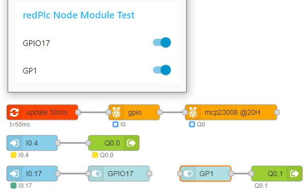

# node-red-contrib-module

Node-Red nodes for using the redPlc module nodes

## Install
Install with Node-Red Palette Manager or npm command:

```
npm install node-red-contrib-module
```
## Usage

With this nodes, you can use the redPlc module nodes<br>
without redPlc ladder logic.<br>
Wire the module nodes in series to Module-Update node.<br>
Use more Module-Update nodes for different update cycle.<br>
The redPlc module nodes creates global variables and updates<br>
the data from/to hardware or communication.<br>
Use Module-Input node for read data from global variables.<br> 
Use Module-output node for write data to global variables.<br> 

## Example
An application with Raspberry Pi gpio and mcp23008 I/O.<br>
Install 
[gpio](https://www.npmjs.com/package/node-red-contrib-redplc-rpi-gpio)
,
[mcp23008](https://www.npmjs.com/package/node-red-contrib-redplc-rpi-mcp23008)
module nodes and Node-Red Dashboard.<br>

Switches are connected to gpio pin GPIO04 and GPIO17.<br>
Set GPIO04, GPIO17 as input-pullup.<br>
mcp23008 is used as output and drives leds on GP0 and GP1.<br>
Set mcp23008 as output<br>
GPIO04 turns GP0 on/off.<br>
GPIO17 sets Dashboard switch GPIO17.<br>
Dashboard switch GP1 sets output GP1.<br>


<br>

## Donate
If you like my work please support it with donate:

[](https://www.paypal.com/cgi-bin/webscr?cmd=_s-xclick&hosted_button_id=ZDRCZBQFWV3A6)
